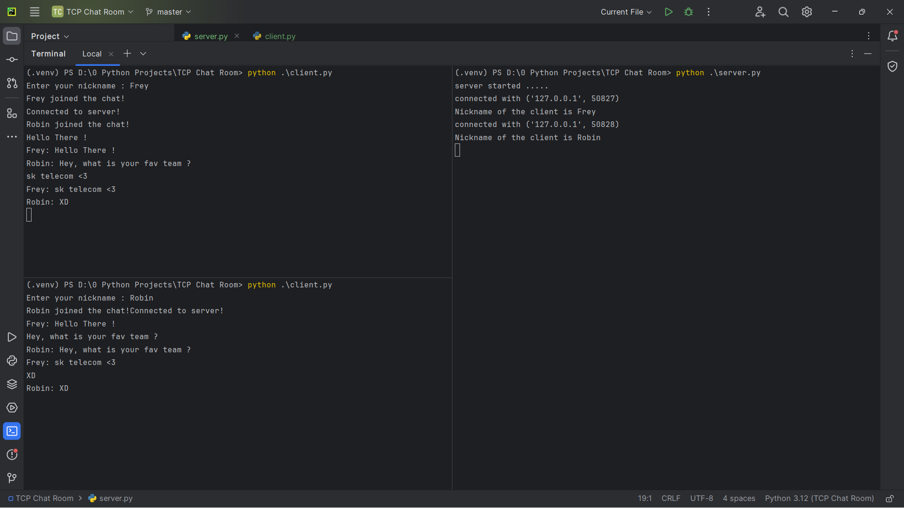

> Sample



> Program

*This is a simple TCP chat room, I was interested in 
learning python related to networking.*

*Here we have two files sever.py and client.py.
In server.py I created a server which receive all messages from
various users and share them to all the users in the server
by this way all the clients and have a proper conversation.*

> Server.py

Here, I added two modules threading and socket.

```
import threading
import socket
```

*Then I started a TCP server using socket with my ip address
localhost. You can use public ip if you want, it will work
anyway. Then I made two arrays clients to save all client
ip address and port, then a nicknames array to save all 
names.*

```
HOST = 'localhost'
PORT = 9090

server = socket.socket(socket.AF_INET, socket.SOCK_STREAM)
server.bind((HOST, PORT))

server.listen()

clients = []
nicknames = []
```

*Then there are three functions, let's see them one by one*

```
def broadcast(message):
    for client in clients:
        client.send(message)
```

*broadcast function will get a message as argument and traverse
through the client's array to send the message to all the 
clients that are connected to the server.*

```
def handle(client):
    while True:
        try:
            message = client.recv(1024)
            broadcast(message)
        except:
            index = clients.index(client)
            clients.remove(client)
            client.close()
            nickname = nicknames[index]
            broadcast(f"{nickname} left the chat!")
            nicknames.remove(nickname)
            break
```

*This handle function gets the client as argument. Then
it starts a while loop the runs infinity, this is used to
receive the client's message and to broadcast it. If the client
has already left the chart the except will start to run and
remove the user from clients and nicknames array along with
a message to inform that the client left the chat*

```commandline
def receive():
    while True:
        client, address = server.accept()
        print(f"connected with {str(address)}")

        client.send('NICK'.encode('ascii'))
        nickname = client.recv(1024).decode('ascii')
        nicknames.append(nickname)
        clients.append(client)

        print(f"Nickname of the client is {nickname}")
        broadcast(f"{nickname} joined the chat!".encode('ascii'))
        client.send('Connected to server!'.encode('ascii'))

        thread = threading.Thread(target=handle, args=(client,))
        thread.start()
```

*This receives function will also run an infinite while loop that
constantly checks for any users to log in. Once someone did it print 
that the client has logged into that chat, along with the nickname
ip address, port. Don't worry they are not visible to the normal 
chart users just for server log. XD*

```commandline
print("server started .....")
receive()
print("server stopped!!")
```

*It will just call the receive function we created to begin the
server once it's started*

> client.py

```commandline
import socket
import threading

HOST = 'localhost'
PORT = 9090

nickname = input("Enter your nickname : ")

client = socket.socket(socket.AF_INET, socket.SOCK_STREAM)
client.connect((HOST, PORT))
```

*Just made a connection to the server we created.*

```commandline
def receive():
    while True:
        try:
            message = client.recv(1024).decode('ascii')
            if message == 'NICK':
                client.send(nickname.encode('ascii'))
            else:
                print(message)
        except:
            print("An error occurred!")
            client.close()
            break
```

*Here, this function will receive all the messages that are sent 
in the server. If the message is 'NICK', it means server is asking
for the nickname to mention the new client. So we sent the nickname
of the client that we collected above. If the message is something
else, they just print it to the user to have a conversation.*

```commandline
def write():
    while True:
        message = f'{nickname}: {input("")}'
        client.send(message.encode('ascii'))
```

*This function will be the one that will get the input from 
the user to share it to others.*

```commandline
receive_thread = threading.Thread(target=receive)
receive_thread.start()

write_thread = threading.Thread(target=write)
write_thread.start()
```

*Then we started two threads. One to receive the messages from 
other users and one to get out message and send it to other users.*

*This is my first time to make this readme file, please inform
me if you thing I need to add or improve with my explanation.*